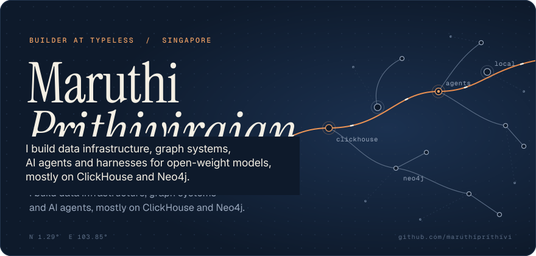
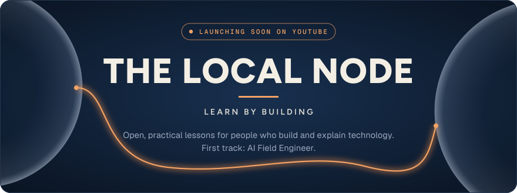
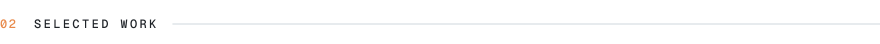
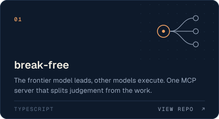
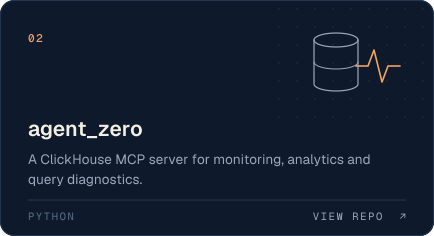
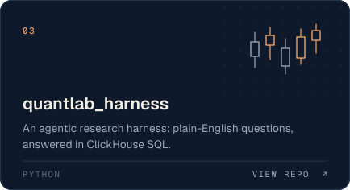
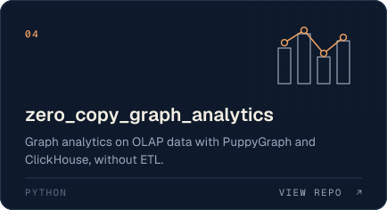
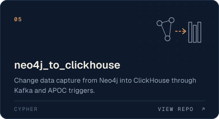
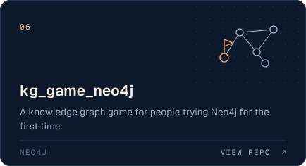

<!-- v3 · Signal. Art direction follows The Local Node brand concepts "Signal" and "Relay". Mobbin refs: 1Password developer tools (mobbin.com/sites/sections/98769065-437c-4aec-a6f9-ba422a7f6b59), Mailchimp developer hero (mobbin.com/sites/sections/35fc90ea-349f-44d7-b050-5a857c28adc3) -->

 

<picture>
  <source media="(prefers-color-scheme: dark)" srcset="v3-assets/signal/label-node-dark.svg">
  
</picture>

  <a href="https://www.youtube.com/@the_local_node"><b>Subscribe for the launch</b></a> &nbsp;·&nbsp;
  <a href="https://github.com/maruthiprithivi/the-local-node">Follow the lessons taking shape on GitHub</a>

 

<picture>
  <source media="(prefers-color-scheme: dark)" srcset="v3-assets/signal/label-work-dark.svg">
  
</picture>

  
  
  
  
  
  

 

<picture>
  <source media="(prefers-color-scheme: dark)" srcset="v3-assets/signal/label-pending-dark.svg">
  
</picture>

Open-source contributions under review, none merged yet: &nbsp;<a href="https://github.com/kunchenguid/firstmate/pulls/maruthiprithivi">22 open pull requests to kunchenguid/firstmate</a> &nbsp;·&nbsp; <a href="https://github.com/cursor/plugins/pull/497">cursor/plugins#497</a> (draft)
